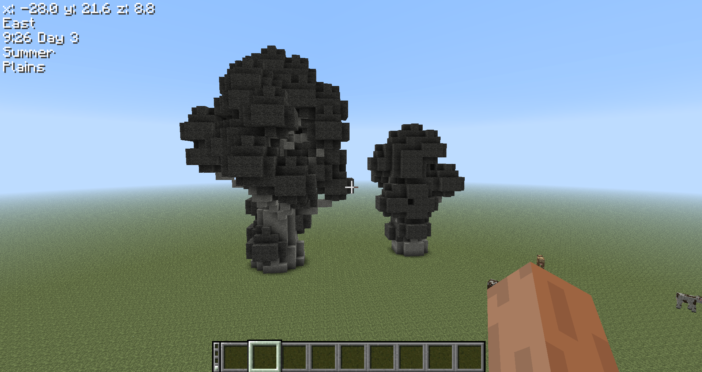
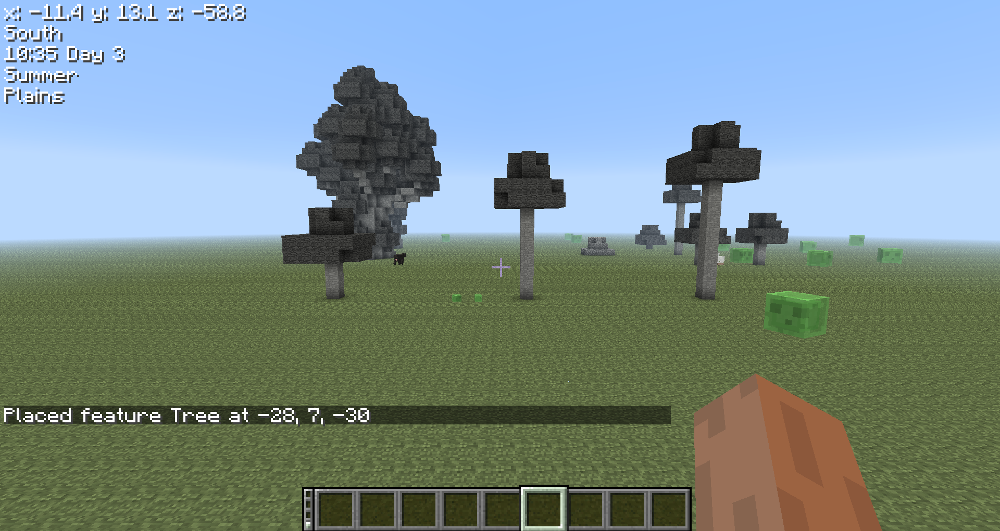
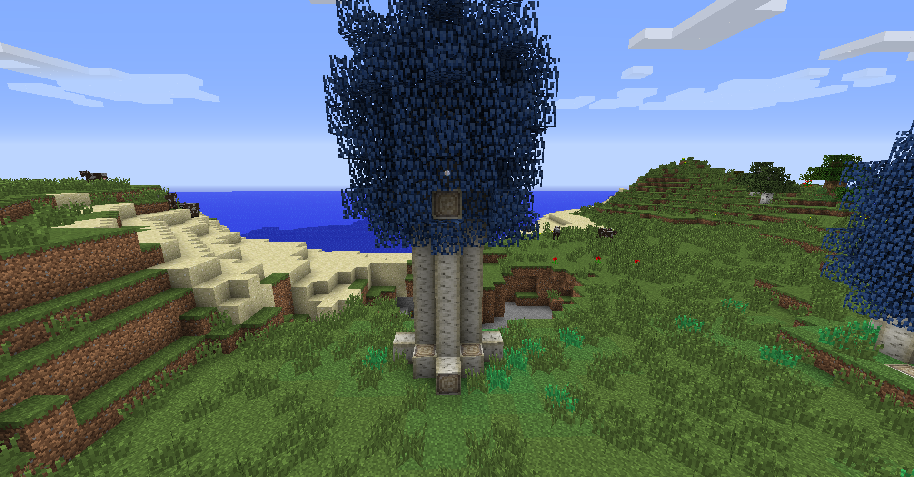
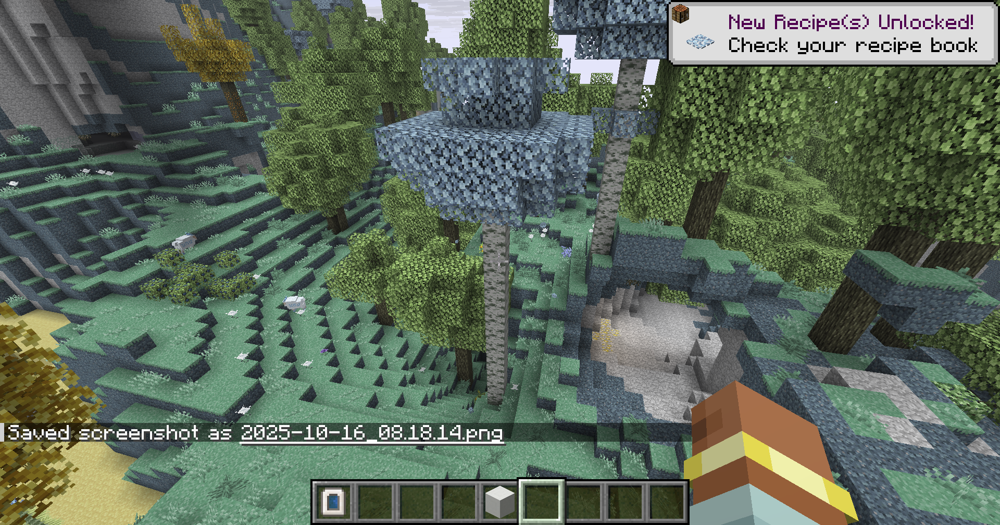
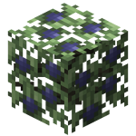
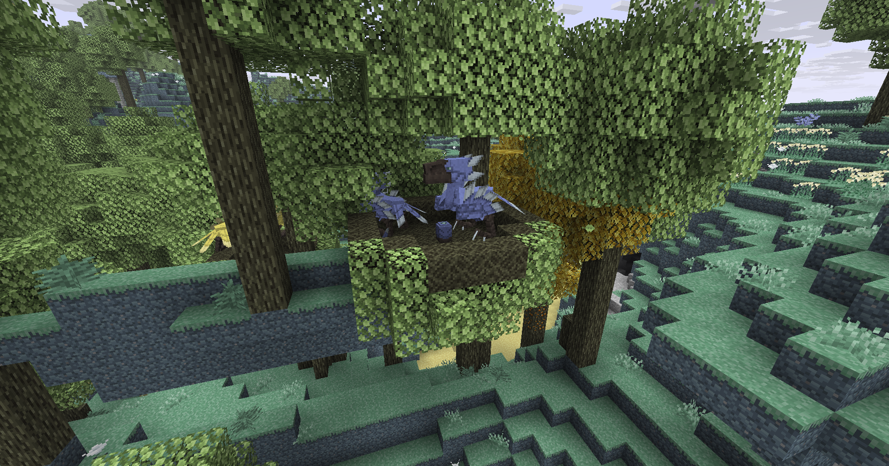

Should be a pretty simple florest biome. The idea is to feature blue trees, moa nests and farmmable berry bushes. This biome will also contain the "deku tree" looking dungeon.

The idea is to have the biome mainly look like a "rain florest" in the sky type of thing. Trees should both be tall and mainly blanket the sky. This biome would perhaps a good place to set an early game base without having to worry about Zephyrs. Aechor flowers also wouldn't spawn here. Though, blue cockatrices can be found wondering around here.

*maybe add a new bob to prey at night here?

## About 'em *Trees*

While the main bulk of the trees should be simple very tall oak trees, spooner trees will also generate commonly. About twice as often as golden trees in the aether plains as is right now. The max size should be 24 and the minimum should be 14 as pictured bellow.

Similarly, the normal trees should go from 6 to 8, and, **very uncommonly** , 12 in height. See under.

For the textures the trunk of the tree should be white with light blue leaves. The planks would be light blue skyroot. Somewhat similar to thaumcraft's trees actually.

Or... aether 2's

## Berry bushes

This should be pretty self explanatory. This biome is supposed to be a very livable (albeit not safe) section of the aether. As such, you may expect to find more food here than usual

So yeah, I just plan on back porting the berry bushes from the newer aether versions to BWA. Should be pretty simple.

as seen on the [wiki](https://aether.fandom.com/wiki/Blueberry_Bush), it should work pretty much just like it. Each blue berry heals a heart and you get 3 to 5 of them per bush.

## Moa nests

Placed on the canopies of trees you should be able to find Moa nests, going near them usually means painful death by angry momma bird. See aether 2 reference:

Should be pretty simple, the nests spawn near trees and the eggs acts like a spawner. The moas it spawn will use a different AI that stays near the nest and will attack anything that gets close to it, a maximum of 3 moas can ever be present at a nest. when broken it will drop a moa egg of it's color. The spawning of defensive moas cannot be stopped unless the egg is stolen. Every moa in "defense" mode will become aggressive to the player while their inventory contains an egg of the same color as the moa.

# Decorations

The biome should have leaf piles spread all over the floor. We might also want to consider adding a new flower for this biome? I think will have the purple ones not spawn at all for this one. I wanted something double block and preferable yellow/pink.

Please see the tulip collection as bellow.

